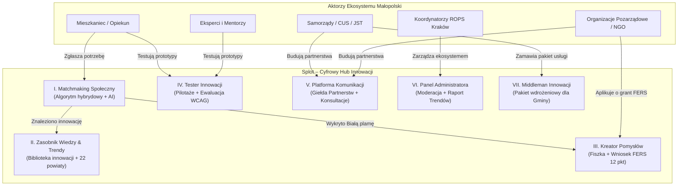

# Splot – Małopolski Hub Innowacji Społecznych (ROPS Kraków)

[](https://hackyeah.pl/)
[](https://rops.krakow.pl/)
[](https://www.w3.org/WAI/standards-guidelines/wcag/)
[](https://nextjs.org/)
[](https://www.djangoproject.com/)

> **Splot** to cyfrowe serce Małopolskiego Hubu Innowacji Społecznych stworzone dla **Regionalnego Ośrodka Polityki Społecznej w Krakowie (ROPS Kraków)**.  
> Łączy potrzeby mieszkańców, energię organizacji pozarządowych (NGO), możliwości samorządów (JST / CUS) oraz wiedzę ekspertów z portfolio ponad 200 sprawdzonych innowacji społecznych w 22 powiatach Małopolski.

---

## Spis treści

1. [O projekcie i misja](#-o-projekcie-i-misja)
2. [Kluczowe moduły systemu (100% pokrycia wyzwania)](#-kluczowe-moduły-systemu-100-pokrycia-wyzwania)
3. [Szybkie Profile Demonstracyjne (Persony Demo)](#-szybkie-profile-demonstracyjne-persony-demo)
4. [Dostępność cyfrowa i Design System (WCAG 2.2 AA)](#-dostępność-cyfrowa-i-design-system-wcag-22-aa)
5. [Architektura techniczna i stos technologiczny](#-architektura-techniczna-i-stos-technologiczny)
6. [Szybki start (Instrukcja uruchomienia)](#-szybki-start-instrukcja-uruchomienia)
7. [Scenariusze demonstracyjne dla Jury (3-minutowe demo)](#-scenariusze-demonstracyjne-dla-jury-3-minutowe-demo)
8. [Struktura repozytorium](#-struktura-repozytorium)
9. [Dokumentacja API](#-dokumentacja-api)

---

## 🌟 O projekcie i misja

W Małopolsce powstaje wiele oddolnych, wartościowych mikrorozwiązań tworzonych przez NGO, Centra Usług Społecznych (CUS) oraz aktywnych mieszkańców. Dotychczas brakowało jednak cyfrowej przestrzeni, która potrafiłaby w sposób systemowy:
- **Zdiagnozować problem** i natychmiast skojarzyć go z przetestowaną innowacją,
- **Wykryć „Białe plamy”** – luki w innowacjach, na które region nie ma jeszcze odpowiedzi,
- **Zredukować biurokrację grantową** przy ubieganiu się o środki FERS (Działanie 5.1 do 50 000 zł),
- **Ułatwić wójtowi lub burmistrzowi wdrożenie innowacji** w formie gotowej usługi komunalnej,
- **Zapewnić pełną dostępność (WCAG 2.2 AA)** dla osób z niepełnosprawnościami i seniorów.

**Splot rozwiązuje ten problem**, dostarczając zintegrowany, intuicyjny i dostępny ekosystem oparty o Next.js, Django REST Framework oraz inteligentnego Asystenta AI.



---

## 🚀 Kluczowe moduły systemu (100% pokrycia wyzwania)

Platforma implementuje **moduł obligatoryjny oraz wszystkie 6 modułów dodatkowych** określonych w wyzwaniu ROPS Kraków:

### I. Matchmaking Społeczny *(Moduł obligatoryjny)*
- **Dwuwarstwowy silnik kojarzenia**:
  1. *Warstwa deterministyczna (Offline-first)*: Scoring słowno-kategorialny oparty o 9 oficjalnych kategorii ROPS, demografię powiatu i grupy docelowe.
  2. *Warstwa semantyczna AI*: Generowanie zrozumiałego dla człowieka, polskiego uzasadnienia dopasowania (*„Dlaczego ta innowacja pasuje”*).
- **Detekcja luk społecznych („Białe plamy”)**: Jeśli wskaźnik dopasowania < 45%, system rejestruje problem jako białą plamę dla regionu i umożliwia 1-kliknięciem przeniesienie danych do Kreatora Pomysłów.
- **Trasy**: `/needs/new` (zgłoszenie potrzeby), `/solutions` (inteligentna wyszukiwarka z AI).

### II. Zasobnik Wiedzy i Trendy Regionalne
- **Biblioteka Innowacji Społecznych ROPS**: Baza innowacji (*BaWita*, *Senior CUDER*, *Merkury*, *Modularne łazienki*, *Organizator Społeczności Lokalnej*, *Kawiarenka Naprawcza*) z transkrypcjami WCAG dla osób niesłyszących, podręcznikami PDF i metrykami replikowalności.
- **Kondycja Małopolski & Mapa Wyzwań**: Interaktywny profil 22 powiatów Małopolski, diagnoza demograficzna (wskaźnik starzenia) i powiązanie z regionalnymi wyzwaniami.
- **Trasy**: `/innowacje`, `/innowacje/[slug]`, `/wyzwania`, `/map`.

### III. Kreator Pomysłów & Generator Wniosków FERS
- **Dwupoziomowa ścieżka innowatora**:
  - *Fiszka Pomysłu (całoroczna, 3-minutowa)*: Lekki formularz zgłoszenia mikropomysłu przez mieszkańca lub NGO.
  - *Generator Wniosków Grantowych (Inkubator Włączenia Społecznego 2.0 / FERS Działanie 5.1)*: Pełny, interaktywny 5-etapowy wizard oparty o **oficjalny 12-punktowy formularz ROPS** (budżet do 50 000 zł, podział na okres przygotowawczy do 3 m-cy i testowy do 9 m-cy).
- **Asystent AI Kreatora**:
  - Podpowiedzi wyróżników innowacji i deinstytucjonalizacji,
  - Automatyczne zaciąganie danych statystycznych z raportów ROPS dla wskazanego powiatu,
  - Generator propozycji etapów testowania i szablonu budżetu,
  - Wizualizacja schematu koncepcji (Mermaid).
- **Gotowy wydruk urzędowy**: Dedykowany widok druku zgodny z wytycznymi formalnymi ROPS.
- **Trasa**: `/kreator`.

### IV. Tester Innowacji
- **Zarządzanie pilotażami**: Przegląd projektów w fazie testów (*BaWita – tablica sensoryczna*, *Merkury – symulator samoobsługowy*).
- **Rekrutacja testerów**: Szybki formularz deklaracji roli (mieszkaniec, opiekun, pracownik CUS/OPS, NGO, ekspert).
- **Ustrukturyzowany feedback WCAG**: Oceny 1–5 (użyteczność, skuteczność, dostępność architektoniczna i cyfrowa), identyfikacja barier, sugestie usprawnień oraz rekomendacja wdrożenia w gminie.
- **Trasa**: `/testy`.

### V. Platforma Aktywnej Komunikacji
- **Giełda Współpracy Międzysektorowej**: Tablica kojarząca samorządy (JST/CUS) z organizacjami pozarządowymi (NGO) do wspólnej realizacji zadań publicznych z filtrem powiatowym.
- **Konsultacje z ROPS & Mentoring ekspercki**: Bezpośredni formularz zadawania pytań z możliwością publikacji zweryfikowanych odpowiedzi jako publiczne **FAQ w Bazie Wiedzy**.
- **Trasa**: `/kontakt`.

### VI. Panel Administratora ROPS Kraków
- **Kokpit Koordynatora Hubu**: Zintegrowany dashboard z kluczowymi wskaźnikami (liczba zgłoszeń, otwarte pilotaże, wnioski do oceny).
- **Moderacja zgłoszeń i Białe plamy**: Akceptacja powiązań problem-innowacja lub kwalifikacja do nowych naborów grantowych.
- **Ocena Wniosków FERS**: Formularz oceny formalnej i merytorycznej z możliwością zmiany statusu wniosku na żywo.
- **Raport Trendów Wojewódzkich**: Analityka potrzeb według powiatów i 9 kategorii ROPS z funkcją generowania gotowego do druku raportu regionalnego.
- **Trasa**: `/admin`.

### VII. Middleman Innowacji (AI dla JST)
- **Transformacja innowacji w lokalną usługę publiczną**: Narzędzie dedykowane wójtom, burmistrzom oraz dyrektorom CUS i OPS.
- **Automatycznie generowany Pakiet Wdrożeniowy**:
  - *Standard usługi społecznej* dostosowany do wielkości gminy (wiejska, miejsko-wiejska, miejska),
  - *Wymogi kadrowe i kompetencyjne* (liczba etatów, kwalifikacje),
  - *Kalkulacja kosztów i montaż finansowy 70/15/15* (70% FERS / 15% PFRON / 15% środki własne gminy),
  - *Roadmapa wdrożenia (3–6 miesięcy)*,
  - *Wzór uchwały intencyjnej Rady Gminy*.
- **Synergia z Modułem V**: 1-kliknięcie przenosi gotową usługę na Tablicę Partnerstw w celu zlecenia zadania lokalnemu NGO.
- **Trasa**: `/middleman`.

---

## 👥 Szybkie Profile Demonstracyjne (Persony Demo)

Aby umożliwić jurorom i testerom natychmiastowe sprawdzenie pełnego cyklu życia innowacji **bez uciążliwego logowania i bez konieczności wpisywania danych z klawiatury**, w górnej belce aplikacji zaimplementowano **Przełącznik Person**:

| Persona | Rola | Instytucja / Miejscowość | Domyślny scenariusz w aplikacji |
|---|---|---|---|
| **Anna Nowak** | Mieszkaniec / Opiekun | Grybów, Powiat nowosądecki | Zgłoszenie problemu opieki nad seniorem w Matchmakingu, udział w testach innowacji |
| **Marek Wiśniewski** | JST / Samorządowiec | Dyrektor CUS w Myślenicach | Generowanie pakietu usługi w Middlemanie AI, poszukiwanie NGO na Giełdzie Partnerstw |
| **Katarzyna Zielińska** | Prezes NGO | Fundacja Aktywna Małopolska (Tarnów) | Wypełnienie wniosku FERS w Kreatorze Pomysłów (50 tys. zł), odpowiedź na zapotrzebowanie gminy |
| **dr Piotr Adamski** | Ekspert branżowy / Mentor | Uniwersytet / Ekspert deinstytucjonalizacji (Kraków) | Dyżur mentorski, ewaluacja prototypu w Testerze, publikacja odpowiedzi w FAQ |
| **Magdalena Kaczmarczyk** | Koordynator ROPS (Admin) | Regionalny Ośrodek Polityki Społecznej w Krakowie | Moderacja zgłoszeń, ocena wniosków grantowych FERS, eksport Raportu Trendów |

*Wybór dowolnej persony automatycznie uzupełnia formularze prawidłowymi danymi teleadresowymi, NIP/KRS, gminą i powiatem.*

---

## ♿ Dostępność cyfrowa i Design System (WCAG 2.2 AA)

Splot został zaprojektowany w myśl zasady **Warm Civic Clarity** – spokojna, ciepła estetyka obywatelska, która budzi zaufanie, jest pozbawiona biurokratycznego chłodu i spełnia rygorystyczne normy dostępności:

- **Dedykowany panel preferencji dostępności** (dostępny z każdego widoku):
  - **Kontrast**: Tryb standardowy, Ciemny, Wysoki kontrast czarno-biały (`hc-black-white`), żółto-czarny (`hc-black-yellow`), Skala szarości (`grayscale`).
  - **Typografia**: Płynne powiększenie tekstu (do 200%), zwiększona interlinia (`relaxed`), powiększone światło międzyznakowe (`wide`), czcionka dla osób z dysleksją (`OpenDyslexic`).
  - **Ruch**: Automatyczne respektowanie i wymuszanie `prefers-reduced-motion`.
- **Pełna obsługa klawiaturą**:
  - Dostępne linki pomijające (*Skip links*),
  - Widoczne wskaźniki fokusu o wysokim kontraście,
  - Minimalne rozmiary pól dotykowych: **min. 44 × 44 CSS px**.
- **Wsparcie dla czytników ekranu**:
  - Semantyczna struktura nagłówków (`h1`–`h4`),
  - Komunikaty dynamiczne przez regiony `aria-live`,
  - Pełne transkrypcje tekstowe dla materiałów wideo w Bibliotece Innowacji.

---

## 🛠 Architektura techniczna i stos technologiczny

System oparty jest na architekturze modularnej, rozdzielającej warstwę prezentacji (PWA Next.js) od warstwy logiki biznesowej i analityki (Django REST Framework):

```text
HackYeah2026-Hubmi/
├── frontend/                # Next.js 16 (App Router) + React 19 + TypeScript
│   ├── app/                 # 12 tras produktowych (Next.js App Router)
│   ├── components/          # Ponad 40 dostępnych komponentów Design Systemu
│   │   ├── accessibility/   # Provider i menu ustawień WCAG 2.2 AA
│   │   ├── admin/           # Dashboard koordynatora ROPS i trendy
│   │   ├── kreator/         # Wizard FERS 12 pkt, Fiszka, diagramy koncepcji
│   │   ├── middleman/       # Pakiet wdrożeniowy dla wójtów/CUS
│   │   ├── testy/           # Pilotaże i formularze ewaluacji
│   │   └── ui/              # Atomowe komponenty UI zgodne z Splot Design System
│   └── docs/                # Specyfikacja design-systemu i dostępności
├── backend/                 # Django 6.1 + Django REST Framework 3.18
│   ├── api/                 # Aplikacja domenowa ROPS Kraków
│   │   ├── models.py        # 13 modeli (Innowacje, Powiaty, Wnioski, Pilotaże)
│   │   ├── views.py         # Silnik Matchmakingu, Middleman AI, Analityka Trendów
│   │   ├── llm_service.py   # Asystent AI (OpenAI API + fallback deterministyczny)
│   │   └── management/      # Komenda seed_demo_data z autentycznymi danymi ROPS
│   └── config/              # Konfiguracja Django, CORS, drf-spectacular (OpenAPI 3.0)
└── skills/                  # Specyfikacja Splot Design System
```

### Stos technologiczny

| Warstwa | Technologia | Wersja | Zastosowanie |
|---|---|---|---|
| **Frontend** | **Next.js** | 16.3.8 | React Server Components, App Router, SSR/SSG, obsługa PWA |
| **UI Library** | **React** | 19.2.8 | Komponenty interaktywne i zarządzanie stanem |
| **Styling** | **Tailwind CSS** | 4.x | Tokeny semantyczne Splot Design System, wsparcie motywów WCAG |
| **Ikony** | **Phosphor Icons** | 2.1.10 | Spójny wizualnie zestaw ikon SVG |
| **Mapy** | **Mapbox GL** | 3.32.0 | Interaktywna mapa Małopolski z podziałem na powiaty |
| **Backend** | **Django** | 6.1 | Główny framework aplikacyjny i ORM |
| **API** | **Django REST Framework** | 3.18 | RESTful API, walidacja, serializacja danych |
| **OpenAPI** | **drf-spectacular** | 0.28 | Automatyczna generacja specyfikacji OpenAPI 3.0 i Swagger UI |
| **Baza danych** | **SQLite** | 3.x | Lekka, przenośna baza relacyjna zasilana seedem demonstracyjnym |
| **Silnik AI** | **OpenAI / Deterministyczny** | GPT-4o-mini | Asystent wniosków FERS, uzasadnienia dopasowań i pakiety dla JST |

---

## ⚡ Szybki start (Instrukcja uruchomienia)

### Wymagania wstępne
- **Python**: 3.12+
- **Node.js**: 20+ (zalecany Node 22)
- **Menedżer pakietów**: `npm` oraz `pip`

---

### Krok 1: Uruchomienie Backend API (Django)

Otwórz pierwszy terminal:

```bash
# 1. Przejdź do katalogu backendu
cd backend

# 2. Aktywuj istniejące środowisko wirtualne (lub utwórz nowe: python3 -m venv .venv)
source .venv/bin/activate

# 3. Zainstaluj zależności
pip install -r requirements.txt

# 4. Zastosuj migracje bazy danych
python manage.py migrate

# 5. Załaduj autentyczne dane demonstracyjne ROPS Kraków (innowacje, wyzwania, powiaty, persony)
python manage.py seed_demo_data

# 6. Uruchom serwer developerski
python manage.py runserver 8000
```

Backend uruchomi się pod adresem: `http://localhost:8000/`.  
Interaktywna dokumentacja Swagger UI: `http://localhost:8000/api/docs/`.

---

### Krok 2: Uruchomienie Frontendu (Next.js)

Otwórz drugi terminal:

```bash
# 1. Przejdź do katalogu frontendu
cd frontend

# 2. Zainstaluj pakiety npm
npm install

# 3. Uruchom aplikację Next.js
npm run dev
```

Aplikacja kliencka uruchomi się pod adresem: `http://localhost:3000/`.

---

### Krok 3: Weryfikacja testów automatycznych

W katalogu `backend/` uruchom zestaw 11 testów integracyjnych badających poprawność wszystkich modułów i schematu API:

```bash
cd backend
source .venv/bin/activate
python manage.py test api
```
*(Wszystkie testy przechodzą w czasie poniżej 0.2 sekundy).*

---

## 🎬 Scenariusze demonstracyjne dla Jury (3-minutowe demo)

Aby w pełni doświadczyć możliwości Splot podczas oceny projektu, polecamy poniższą 3-minutową ścieżkę:

### Scenariusz A: Mieszkaniec szuka pomocy (Moduł I i II)
1. Wejdź na `http://localhost:3000/start`.
2. W belce na górze upewnij się, że aktywna jest persona **Anna Nowak (Mieszkaniec)**.
3. Przejdź do **Zgłoś potrzebę** (`/needs/new`). Zauważ, że Twoje dane kontaktowe i powiat nowosądecki są już wpisane.
4. Wpisz opis problemu, np. *„Mój ojciec choruje na Alzheimera, szukam zajęć sensorycznych w domu”*.
5. Kliknij **Znajdź rozwiązanie**. Silnik wskaże innowację **BaWita – Mobilna sensoryczna tablica aktywizująca** z wysokim wynikiem dopasowania i wygenerowanym uzasadnieniem.
6. Otwórz kartę innowacji, obejrzyj wideo z transkrypcją WCAG i pobierz podręcznik wdrożeniowy PDF.

### Scenariusz B: Wykrycie „Białej plamy” i ubieganie się o grant FERS (Moduł I i III)
1. Wyszukaj nietypowy problem, np. *„Brak tłumacza migowego na dialekt łemkowski w sołectwie”*.
2. System poinformuje o wykryciu **Białej plamy (Luki w innowacjach)**.
3. Kliknij przycisk **Przekształć w pomysł w Kreatorze**.
4. Przełącz personę na **Katarzyna Zielińska (NGO – Fundacja Aktywna Małopolska)**.
5. Zobacz oficjalny 12-punktowy formularz grantowy FERS Działanie 5.1 (do 50 000 zł) z autouzupełnionymi danymi KRS i budżetem.
6. Skorzystaj z przycisku **Asystent AI**, aby wygenerować wyróżniki innowacji i model deinstytucjonalizacji.
7. Zobacz podgląd oficjalnego arkusza do druku i kliknij **Wyślij wniosek do ROPS**.

### Scenariusz C: Samorząd wdraża usługę – Middleman AI (Moduł VII i V)
1. Przełącz personę na **Marek Wiśniewski (JST – Dyrektor CUS Myślenice)**.
2. Wejdź w **Middleman Innowacji** (`/middleman`).
3. Wybierz innowację *BaWita* oraz profil gminy Myślenice.
4. Kliknij **Generuj Pakiet Wdrożeniowy**. Middleman AI wygeneruje:
   - Wymogi etatowe dla CUS,
   - Montaż finansowy: 70% FERS (84 000 zł), 15% PFRON (18 000 zł), 15% gmina (18 000 zł),
   - Harmonogram wdrożenia na 6 miesięcy oraz wzór uchwały Rady Gminy.
5. Kliknij **Zleć realizację lokalnemu NGO na Giełdzie Partnerstw** – ogłoszenie natychmiast trafia na platformę komunikacji.

### Scenariusz D: Koordynator ROPS zarządza regionem (Moduł VI)
1. Przełącz personę na **Magdalena Kaczmarczyk (ROPS Kraków)**.
2. Przejdź do **Panelu Administratora** (`/admin`).
3. Przejrzyj zgłoszone białe plamy w 22 powiatach oraz oceń wniosek grantowy Katarzyny Zielińskiej.
4. Kliknij **Generuj Raport Trendów Wojewódzkich** – otrzymasz gotowy do wydruku zestaw analityczny z potrzebami mieszkańców Małopolski.

---

## 📁 Struktura repozytorium

```text
├── AGENTS.md                    # Wytyczne architektoniczne i kontekst całego projektu
├── CHALLENGE.md                 # Treść oficjalnego zadania ROPS Kraków na HackYeah 2026
├── PLAN.md                      # Szczegółowy plan implementacji i stan realizacji modułów
├── README.md                    # Niniejsza dokumentacja główna
├── backend/                     # Backend Django REST Framework
│   ├── AGENTS.md                # Wytyczne techniczne dla agentów backendu
│   ├── GEMINI.md                # Założenia hackathonowe (SQLite, bez zbędnego overheadu)
│   ├── README.md                # Techniczna dokumentacja backendu i opis payloadów
│   ├── manage.py                # Narzędzie CLI Django
│   ├── requirements.txt         # Zależności Python
│   ├── api/                     # Moduł API ROPS Kraków
│   │   ├── models.py            # Modele danych innowacji, wniosków, pilotaży, powiatów
│   │   ├── serializers.py       # Serializery DRF ze schematami OpenAPI
│   │   ├── views.py             # Widoki, silnik dopasowań, Middleman AI, trendy
│   │   ├── llm_service.py       # Integracja z modelem językowym (OpenAI / reguły)
│   │   ├── tests.py             # Testy automatyczne DRF
│   │   └── management/commands/ # Skrypt seed_demo_data.py
│   └── config/                  # Główne ustawienia projektu Django
├── frontend/                    # Aplikacja frontendowa Next.js 16
│   ├── AGENTS.md                # Wytyczne architektoniczne frontendu i zasady PWA
│   ├── package.json             # Zależności npm
│   ├── app/                     # Strony i layouty Next.js (App Router)
│   │   ├── page.tsx             # Strona główna (Hero, wyszukiwarka, statystyki)
│   │   ├── start/               # Pulpit mieszkańca
│   │   ├── needs/               # Wizard zgłaszania potrzeb społecznych
│   │   ├── solutions/           # Dopasowywanie innowacji z AI
│   │   ├── innowacje/           # Biblioteka Innowacji Społecznych ROPS
│   │   ├── wyzwania/            # Mapa Wyzwań i profil 22 powiatów
│   │   ├── kreator/             # Kreator Pomysłów i Wniosków FERS 12 pkt
│   │   ├── testy/               # Tester Innowacji i ewaluacje WCAG
│   │   ├── kontakt/             # Giełda Współpracy i zapytania do ROPS
│   │   ├── middleman/           # Middleman AI dla samorządów (JST)
│   │   ├── admin/               # Panel moderacji i trendów ROPS
│   │   └── map/                 # Mapa geolokalizacyjna innowacji
│   ├── components/              # Dostępne komponenty UI (WCAG 2.2 AA)
│   └── docs/                    # Dokumentacja Design Systemu i Dostępności
└── skills/                      # AI Skill: Splot Design System
```

---

## 📡 Dokumentacja API

Backend Splot generuje pełną, interaktywną specyfikację **OpenAPI 3.0**:

- **Swagger UI**: [`http://localhost:8000/api/docs/`](http://localhost:8000/api/docs/) – interaktywne testowanie żądań w przeglądarce.
- **Redoc**: [`http://localhost:8000/api/redoc/`](http://localhost:8000/api/redoc/) – czytelna dokumentacja schematów danych.
- **OpenAPI Schema (JSON)**: [`http://localhost:8000/api/schema/`](http://localhost:8000/api/schema/) – surowy schemat maszynowy.

### Główne punkty końcowe (Endpoints)

| Metoda | Ścieżka URL | Opis |
|---|---|---|
| `POST` | `/api/matchmaking/analyze/` | **Silnik Matchmakingu**: analiza problemu, kojarzenie z innowacjami, detekcja luk |
| `GET` | `/api/innovations/` | Katalog innowacji z filtrami (`?category=`, `?stage=`, `?q=`) |
| `GET` | `/api/counties/` | Baza 22 powiatów Małopolski ze statystykami demograficznymi |
| `GET\|POST` | `/api/ideas/` | Składanie i przeglądanie Fiszek Pomysłów oraz wniosków grantowych FERS |
| `POST` | `/api/ideas/{id}/evaluate/` | Formalna i merytoryczna ocena wniosku przez koordynatora ROPS |
| `GET\|POST` | `/api/pilots/` | Baza pilotaży innowacji oraz rekrutacja testerów |
| `POST` | `/api/evaluations/` | Ankieta ewaluacyjna z testów (oceny 1–5 WCAG, bariery, wdrożenie) |
| `GET\|POST` | `/api/partnerships/` | Giełda współpracy międzysektorowej (JST <-> NGO) |
| `GET\|POST` | `/api/inquiries/` | Pytania do ROPS i mentorów z opcją publikacji jako publiczne FAQ |
| `POST` | `/api/middleman/package/` | **Middleman AI**: generowanie pakietu wdrożeniowego usługi dla JST |
| `GET` | `/api/admin/trends/` | Agregacja trendów regionalnych i wykaz „Białych plam” |
| `GET` | `/api/health/` | Monitor stanu zdrowia serwisu |

---

## 🏆 Podsumowanie

**Splot** nie jest jedynie kolejną bazą danych czy statycznym portalem informacyjnym. To kompletny, działający w praktyce **cyfrowy ekosystem innowacji społecznych**, który:
- Przekłada 10 lat doświadczenia ROPS Kraków na nowoczesne narzędzie cyfrowe,
- Spina mieszkańców, samorządy i NGO w jednym, synergicznym łańcuchu wartości,
- Spełnia najwyższe standardy dostępności cyfrowej (**WCAG 2.2 AA**),
- Jest gotowy do natychmiastowego wdrożenia w Małopolsce.
